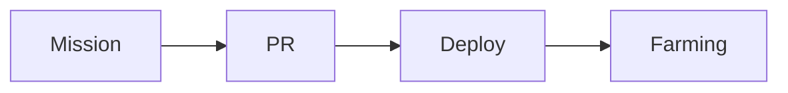

# TLOZ Mission and Project Operator

Operate TLOZ data through the Zipform Data API. Use `https://zipform.zivelo.dev` for current production data and mission mutations; use the explicitly configured local API only for contract rehearsal, read-only development, and performance tests.

## Guardrails

- Use the API instead of Prisma, PostgreSQL, seed files, or browser automation.
- For local work, start `pnpm api:local`; it uses the mock driver on `127.0.0.1` and a development-only API key. Never point it at production `DATABASE_URL`.
- For repeatable performance checks, run `pnpm perf:api` against local servers and compare the same workload; do not use production as a load-test target.
- Read a resource before writing it and preserve unrelated content.
- Inspect `GET /api/openapi` before using undocumented fields or operations.
- Send the Bearer token only from `ZIPFORM_TOKEN`; never print, persist, commit, or place it in a payload.
- Use the smallest valid mutation and verify every mutation with a subsequent GET.
- Report failed, ambiguous, or unverified changes honestly.
- Do not delete a mission without an explicit request identifying that mission.
- Change `ownerId` only when the user explicitly authorizes the assignment and the target user is resolved unambiguously through the API.

Read [references/authentication.md](references/authentication.md) when configuring or troubleshooting authentication. Read [references/api-workflows.md](references/api-workflows.md) before creating or mutating missions or relationships.

## Resolve a mission

1. Select the API origin:
   - For mission consultation, mutation, and final verification, use `https://zipform.zivelo.dev` and continue with the production token below.
   - For local contract rehearsal or benchmarks, use `http://127.0.0.1:3100` with the key printed by `pnpm api:local`; local data is not evidence about production.
2. Confirm `ZIPFORM_TOKEN` exists without printing it when the production origin is selected:
   - If the variable is not set, do not abort. Inform the user that they need to export it: `export ZIPFORM_TOKEN="zaf_..."` in their terminal, then wait for confirmation before continuing.
   - Validate with `curl -s -H "Authorization: Bearer $ZIPFORM_TOKEN" "https://zipform.zivelo.dev/api/v1/projects"`; if 401, report that the token is invalid or expired and ask the user to provide a valid one.
3. Call `GET /api/v1/users/me` and resolve the authenticated user before discovering work.
4. If the user supplied a mission `displayId`, resolve that exact mission. Ownership priority must never replace an explicit identifier.
5. If the user asked to choose or suggest work without a mission identifier:
   - Query `GET /api/v1/missions?ownerId={authenticatedUserId}&limit=100` first; include `projectId` when the user constrained the project.
   - Consider assigned missions in status order `now`, `next`, then `later`. Exclude `completed` and `blocked` unless the user explicitly requests them.
   - Prefer a mission with clear pending outcomes and no unresolved dependencies. Read its complete detail before selecting it.
   - Only search other owners as a fallback. Do not implement another owner's primary deliverable until reassignment is explicitly authorized and verified.
6. When a project constraint must be resolved, call `GET /api/v1/projects` and match by slug, exact name, or unambiguous partial name.
7. Match human-readable `displayId` values only after retrieving candidates; never use a `displayId` as the internal ID.
8. Call `GET /api/v1/missions/{id}` and read the complete current detail.
9. Inspect `GET /api/openapi` if a required field, response, enum, or route remains uncertain.

Do not guess when multiple projects or missions match.

### Mission status enum

The valid mission status values are:

- `now`
- `next`
- `later`
- `completed`
- `blocked`

Use these exact lowercase values with `PATCH /api/v1/missions/{missionId}/status`.

## Write Markdown documents

Mission content uses two separate fields: `description` is the short summary shown in previews (maximum 280 characters), while `descriptionDetail` is the full Markdown document (maximum 20,000 characters). The legacy `conclusion` field is no longer part of the contract.

Store checkboxes in the complete Markdown detail document:

```md
- [ ] Pending verifiable outcome
- [x] Completed verifiable outcome
```

Before `PUT /api/v1/missions/{id}/document`, preserve the short `description`, relevant detail notes, references, and existing checkboxes. Send the complete desired `markdown`, not a fragment. Keep checkboxes brief, independently verifiable, ordered when sequence matters, and limited to the mission scope.

Write concise, actionable titles. Describe the expected outcome, necessary context, scope boundaries, and how completion is verified. Apply Scrum or user-story language only when it improves clarity.

Project content follows the same summary/detail split, but updates through `PATCH /api/v1/projects/{id}` with the smallest payload containing `description` and/or `descriptionDetail`. Read the project first and preserve unrelated fields.

Use fenced Mermaid blocks inside `descriptionDetail` when a diagram makes a workflow, dependency graph, or lifecycle materially clearer:

````md

````

- Keep the source concise and valid Mermaid; prefer `flowchart` unless another diagram type communicates the relationship better.
- Keep sensitive values and credentials out of labels.
- Do not place Mermaid in the short `description` field.
- Preserve ordinary fenced code blocks as ordinary code.
- Verify the fenced source through the subsequent GET. Treat rendered output as a preview or post-deploy verification because the API only stores Markdown.
- Expect invalid Mermaid to remain readable as source through the UI fallback; do not treat that fallback as successful diagram validation.

## Mutate and verify

1. Retrieve the current mission.
2. Prepare the smallest payload using only documented fields and enum values.
3. Execute the mutation once and inspect its status and error body.
4. Call `GET /api/v1/missions/{id}`.
5. Compare the persisted state with the intended result.
6. For document changes, verify `displayId`, `progress`, checklist length, completed items, and returned Markdown.
7. Do not claim success when persisted values differ.

For a server error, GET the resource when safe to determine whether the mutation persisted. Do not retry automatically when that could duplicate or overwrite data.

## Ownership

Resolve the authenticated agent with `GET /api/v1/users/me`; never infer identity from the API key. Resolve another owner through `GET /api/v1/users` using an exact username, email, or ID. Do not guess when multiple users match.

Assign a mission to another human or agent when the user explicitly requests it, the target exists, and the request identifies the target unambiguously. Read the mission before changing `ownerId`, use the smallest PATCH, and verify the assignment through a subsequent GET.

Treat ownership and execution as separate concerns:

- Consultation, refinement, documentation, status changes, relationships, checkbox maintenance, verification, and owner assignment are assistant operations and may be performed regardless of the current owner when the user authorizes them.
- Implementing the mission's primary deliverable, completing its technical work, or representing that work as finished requires the mission to belong to the authenticated agent. If another owner is set, assist without taking over the underlying work, or ask the user to reassign it first.
- Self-assignment is appropriate only when the authenticated agent will implement the code or produce the primary deliverable. Explain why and obtain explicit confirmation before changing `ownerId` to the authenticated agent.
- Never change ownership implicitly merely because the agent consulted or edited mission metadata.

## Pull request handoff

When mission work produces a repository change:

1. Read the repository `AGENTS.md` and `.github/pull_request_template.md` before opening or updating the pull request.
2. Fill the template with verified mission identifiers, behavior changes, public contracts, migration order, automated results, relevant manual checks, risks, and pending work. Remove unused placeholders.
3. Attach the pull request to the mission as a Resource only after the pull request exists, using the title requested by the mission or plan.
4. Monitor CI and preview checks. Update mission checkboxes only when supported by implementation and verification evidence.
5. Follow the merge authority in `AGENTS.md`; leave the pull request ready for the user and report its URL and checks.
6. Mark the mission completed only after all mission-specific closure conditions have been met and verified through the API.

## Local API and approval minimization

- Prefer `pnpm api:local` for non-production reads, payload rehearsal, and load testing so those requests stay on loopback and do not require external network access.
- Use `pnpm tloz:api /api/v1/... [GET|POST|PATCH|PUT|DELETE]` for production calls. The wrapper fixes the production origin, reads `ZIPFORM_TOKEN` only from the environment, and never prints it.
- A persistent approval for the narrow wrapper command can prevent repeated permission prompts. If that approval is unavailable, do not substitute mock data for a production mutation or claim a current production read was verified; report the external-access blocker once.

## Report results

State one result: `Consulted`, `Proposed`, `Created and verified`, `Updated and verified`, `Assigned and verified`, `Deleted and verified`, `Not changed`, `Blocked by authentication`, `Blocked by validation`, or `Could not be verified`.

Include the mission `displayId`, title, project, changed elements, verification endpoint and values, and whether ownership remained unchanged. Include the internal ID only when operationally useful.
